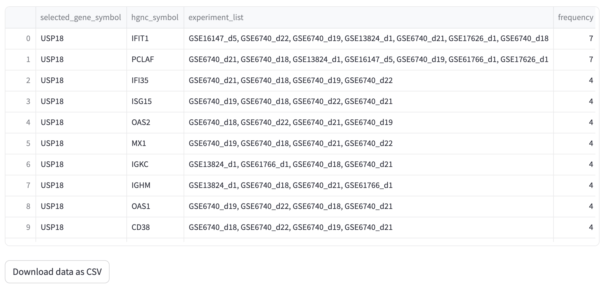

# Querying in the user interface 

HIHISIV can be queried through a web interface in which the user can configure and adjust the parameters of a query. There are six query interfaces with major analytic functions, which are `Gene`, `Transcripts`, `Biological Process (GO)`, `Ontology terms`, `Single gene co-expression network`, and `Gene set co-expression network`. The resulting information can be exported in comma-separated values (CSV) file for further data manipulation. Public access and documentation are freely available through the database web page. Below we provide a set of illustrative examples in a biological context to demonstrate how researcher can utilize HIHISIV to explore relevant datasets, identify key genes associated with immune responses, analyze co-expression networks, and elucidate relevant biological processes related to SIV and HIV-1 infections.

<!---
=== GENE ===
--->
### Gene

In this mode, the user can select the conditions under which a gene of interest shows differential expression. As an example, Figure 4 presents the results for the gene `*USP18*`, (Ubiquitin specific peptidase 18) that belongs to the ubiquitin-specific proteases (UBP). The USP18 gene and its protein product, *USP18*, are known to be involved in the innate immune response to viral infections, particularly in response to type I interferons, which are cytokines produced by the body during viral infections. The applied thresholds for differential expression analysis were adjusted p-value (adj_pvalue) <= 0.05 and |log-FC| > 1. The results show this gene was DE in seven experiments, for example in the comparison reshus uninfected versus acute infection (GSE16147_d5, GSE17626_d1, GSE61766_d1), humans uninfected versus acute infection (GSE6740_d18) and human non-progressor versus acute infection (GSE6740_d21).

<!---
=== TRANSCRIPT ===
--->
### Transcript

This mode is similar to the previous one, but instead of the querying by gene symbol or entrez_gene_id, the user may be interested in a specific probe or transcript id. In the example shown in Figure 5, the probe id `Mmu.STS.4748.a.s1_at` is selected based on the criteria of adj_pvalue <= 0.05 and |log-FC| > 1. As this probe id is a specific to microarray platforms in *M. mulatta* (GPL3535 - Affymetrix Rhesus Macaque Genome Array) the results show only experiments that used this platform.

<!---
=== GENE ONTOLOGY ===
--->
### Gene Ontology

This mode presents the results of the enrichment for GO terms related to BP for each comparison derived from the DEG analysis. By utilizing this mode, researchers can identify experiments that exhibit enrichment in specific BP terms of interest. For instance, in Figure 6, the BP term `cellular response to type II interferon`  (`GO:0071346`) was found enriched in the experiments GSE6740_d1 (CD4+ versus CD8+ in acute infection), GSE6740_d2 (CD4+ versus CD8+ in chronic infection) and GSE13824_d1 (uninfected versus infected). Additionally, this mode provides information about the genes that were enriched within this specific ontology. To ensure statistical robustness, only the results with a significant p-value < 0.001 are displayed in the database.

<!---
=== TRAIT ===
--->
### Ontology terms

By integrating ontology terms with the experimental information, our approach provided a comprehensive understanding of the underlying biological contexts and enriched the dataset's metadata with valuable semantic annotations. In the 'Ontology term' mode the example in Figure 7 shows the experiment associated with the term `Encephalitis` (project GSE13824).

<!---
=== SINGLE GENE CO-EXPRESSED ===
--->

### Single gene co-expression network

This query mode 'Single gene co-expression network' represents the genes that were co-expressed with a selected target gene. In the example shown in Figure 8, we are using the same gene as in the 'Gene' mode, `*USP18*` (adj_pvalue <= 0.05 and |log-FC| > 1). The result displays a set of genes that are co-expressed with USP18 in different experiments (e.g., *IFIT1*, *PCLAF*, *IFI35*, *ISG15* and *OAS2*). The thickness of the connections between genes depends on the number of co-expressed experiments that the target gene has with the resulting gene. For instance, IFIT1 (interferon induced protein with tetratricopeptide repeats 1) is a gene that encodes a protein that may inhibit viral replication and translational initiation (provided by RefSeq, Aug 2012). This gene is co-expressed with the USP18 gene in seven experiments, including GSE16147_d5, GSE13824_d1, and GSE6740_d22. The query result can be visualized as a graph representing the gene co-expression network as well as a tabular format. 

<!---
=== GENE SET CO-EXPRESSION ===
--->
### Gene set co-expression network

In this query mode, instead of single co-expression gene, a set of genes can be entered and the result displays a visual network representation. The associated table facilitates a comprehensive understanding of the co-expression patterns and experimental associations among the genes of interest. For instance, in the example shown in Figure 9, we used the gene mentioned in the previous examples, *USP18*, along with other genes such as *STAT1*, SP100, IFI35, APOBEC3A, MX1, and CXCR5 (adj_pvalue <= 0.05 and |log-FC| > 1). The query result reveals an interconnected network of genes associated with the immune response, particularly in defense against pathogens such as viruses. Additionally, the result presented as a table indicating the experiments associated with each par of connections.

