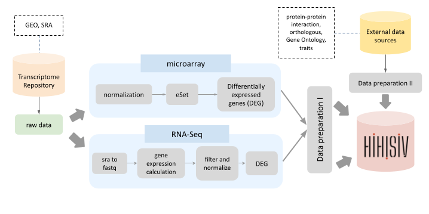
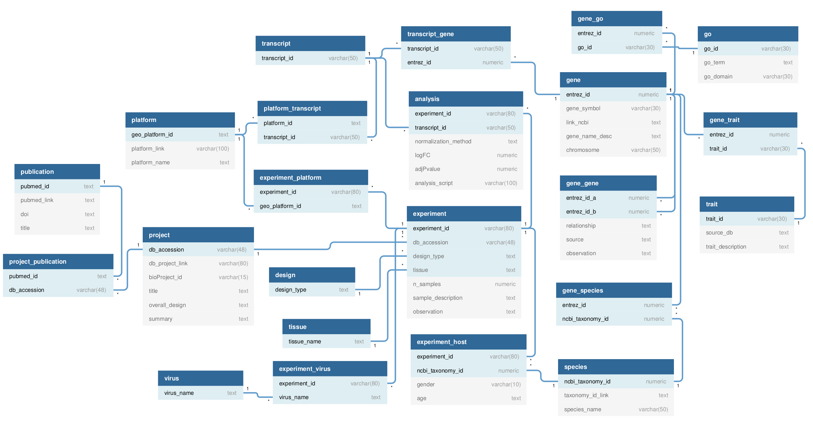
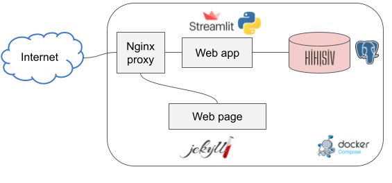

# HIHISIV documentation

## 1 - Datasets

### 1.1 - Transcriptome data

The datasets are composed of microarray data expression of viral infection by SIV or HIV hosts retrieved from the GEO from the National Center for Biotechnology Information (NCBI). The exception was the datasets `3070984318` and `2932572286` from [MACE repository](mace.ihes.fr){:target="_blank"}.

Forty-six entries were found using keyword-based searches `SIV` or `HIV`. After the data set descriptions were manually read to identify each study and subsequently established exclusion criteria of the project, or in some cases, removing some samples from the project. To remove projects and/or samples the following criteria were adopted:

* No information about the samples allowing comparisons (example: host type);
* Antiviral therapy ARV;
* Vaccine;
* Monoclonal antibody;
* Cell culture;
* Number of the samples (per group) less than 3;

Using the same criteria, one RNA-Seq project from short-read sequencing (SRS) was selected to create the pipeline analysis and compose the conceptual model (`PRJNA488556`). More RNA-Seq SRS will be incorporated in the posterior database updates.

Considering the host type of host the following nomenclature was adopted:

* natural-host: refers to natural host primates such as African Green Monkeys and Sooty mangabeys;
* non-natural-host: refers to non-natural host primates such as Reshus monkey (*Macaca mulatta*);
* non-progressor: refers to a human that has not progressed to immunodeficiency;

Considering the differences in the groups analyzed, the following terms were used:

* pre-infection: individuals that will be infected posteriorly by SIV;
* uninfected: refers to an independent group of monkeys or humans;
* acute: individuals infected in the first phase of the disease;
* chronic: individuals infected in the later phase of the disease;

In each project, the data was compared pair by pair and named each comparison as `experiment`. In some cases, these projects resulted in more than one experiment. For example, the project `GSE7157` worked with non-natural species during three different phases of the infection (pre-infection, acute and chronic). This project was divided into three different experiments by pair to pair (preInfection versus acute; preInfection versus chronic and acute versus chronic). The complete list of experiments is shown in the supplementary material 1.

### 1.2 - Biological external sources

For each host species, the annotation about the `genes` was incorporated from the NCBI gene database and from the annotation microarray platform ([GPL] from GEO. In this biological context, some genes play key roles in understanding the complexity of the immune system, especially genes that will become `transcript factors`, `cytokines`, `restriction factors`, and `surface proteins`. The information about this key (named in the database as `trait`) was retrieved from the NCBI database and incorporated in HIHISIV.
Information about the gene-gene interaction for humans was added from Protein-Protein interaction (PPI) from [String database](https://string-db.org/){:target="_blank"}. The combined score $>$ 300 was used to include the links among the genes.
The orthologous genes in *Macaca mulatta* and *Homo sapiens* were mapped using [bioRmat](https://bioconductor.org/packages/release/bioc/html/biomaRt.html){:target="_blank"} R library. The same library was used to add information about the Gene Ontology (GO) included the domains of molecular function MF, biological process BP, and cellular component CC.

## 2 - Data analysis

Due to the heterogeneity of experiments as conducted by different research teams, assay platforms, viruses, and tissue, the analysis was conducted separately through the pipeline delineated in a data flow shown in Figure 1. The list of experiment with the correspondent normalization matrix it is available in HIHISIV database.

### 2.1 - Microarray data analysis

With exception of the experiment extracted from the MACE repository (described later), all microarray data were downloaded from the Affymetrix platform. The datasets were normalized using the MAS5 normalization method using the `Affy` R package (Gautier, 2004) and resulting in a normalized matrix with the probes. The datasets from the MACE repository used ABI Human Whole Genome Arrays v2.0 (Applied Biosystems). In this case, the probes were removed if there were more than 5\% missing values across samples. The absent data were estimated using the weighted k-Nearest Neighbor (kNN) algorithm, with k $=$ 10, as proposed in Troyanskaya and implemented in the R `impute` package. Also, 20\% lower variance probes were removed to eliminate inherent noise.

The experimental design was added in the e-set step. For each experiment, a pair group was compared and the first condition was considered the reference (0). For instance, pre-infection *versus* acute infection.

Finally, the detection of the differentially expressed gene (DEG) was based on normalized datasets by the fitting of the gene-wise linear model (for each probe) followed by moderated t-tests implemented in the `limma` packages in R (Smyth2004). The adjusted p-value and the log fold-change were calculated and measured the up and down-regulated genes between the pair sample groups.
Any transcript identifier was removed from the microarray platform and some probes mapped to more than one entrez_gene_id.

### 2.2 - RNA-Seq analysis

To compose the standardized pipeline the dataset using the RNA-Seq platform was collected from the SRA repository (SRS from NextSeq 550 *Homo sapiens*). Firstly the data were transformed to Fastq using sratoolkit (version 2.10.5). RSEM `rsem-calculate-expression` (version 1.3) was used to align the transcriptome dataset in the genome reference (USCS hg19). After the mapping, the DEG was evaluated using the library `limma` (limma-voom). The annotation was conducted by the R libraries `TxDBHsapiens`, `HomoSapiens` and `tx.DbHSapiens.uscg-hg19.knowGenes`. The gene identifiers ucsc_id were kept.

QC com fastqc.

### 2.3 - Data preparation

After the analysis, the modules data preparation I and II were created to prepare the data as input in the HIHISIV database.
These modules used R script language that removes duplicated data, organizes the datasets resulting in 23 tables.

## 3 - Database, design and description 

To reproduce the concepts of interactions among the entities such as genes, ontologies, experiments we represent this scenario using a conceptual model (Figure 2) described below.

* **project** describes information about the original project from the GEO. Contains db_accession (key), project_link, bio_project_id, title, overall_design, and summary.
* **publication** contains information about publications related to the project. The attributes are pubmed_id (key), pubmed_link, doi, and title.
* **experiment** describes the experiments derived from the project (one or more). This entity contains information about the experiment_id (key), db_accession (foreign key), design_type (foreign key), tissue (foreign key), host_type, n_samples, sample_description and observation.
* **design** it has a unique attribute that describes the type of comparative design among the samples analyzed (by pairs).
* **tissue** it has a unique attribute that describes the tissue used in the experiment.
* **virus** describes the virus strain used in the experiment (in case of the SIV) or the type of HIV (attribute virus_name is the key).
* **species** contains information about the taxonomy of the species. The attributes are ncbi_taxonomy_id (key), taxonomy_id_link, and specie_name.
* **platform** describes the kind of high-throughput gene expression platform used. Contains information about platform_id (key), platform_link and platform_name.
* **transcript** it has a unique attribute describing the probe_id (key) related to the platform.
* **gene** contain information about the gene and the attributes are: entrez_gene_id (key), gene_symbol (oficial HUGO name), link_ncbi, gene_name_desc and chromosome.
* **trait** this entity was created to provide external information about a gene, for example, if the specific gene is a transcription factor. This entity contains information about trait_id (key), source_db, and trait_description.
* **go** provides mappings between entrez gene identifiers and the Gene Ontology (GO) identifiers that they are directly associated with. The attributes are go_id (key), go_term_name, and go_domain (molecular function MF, biological process BP, and cellular component CC).
* **gene_gene** describe the relationship among the genes. The attributes are entrez_id (external key), relationship, and source of the information.
* **analysis**  this entity contains information about the parameters used during the analysis by RNA-seq or microarray platforms. The attributes are experiment_id and transcript_id (external keys), normalization_method, logFC, adjPvalue and analysis_script.

## 4 - System architecture, Implementation and Access 

HIHISIV was designed and implemented as a multiple-component framework, as represented in Figure 3.
The database was implemented and instantiated in a PostgreSQL server following the same conceptual model described previously.
There is also the web application that provides a user-friendly interface implemented in the *Streamlit* Python library with predefined parameterizable queries to be executed in the database. It enables the analysis of gene expression levels in HIV and SIV hosts. The results are displayed in tables or networks, and all the data can be downloaded by the users. Other Python libraries used in the implementation include `psycopg2`, for connecting to the PostgreSQL database and executing queries; `pandas` for manipulating data frames; and `networkx` for building networks.

There is also a static web page that contains a description of how the database was built a link with the source data that were used. The web page was written using jekyll framework. Finally, the *Nginx proxy* was used to route the requests from the Internet either web app or web page. For each of these components, a docker container was built and docker-compose was used to connect all those containers. The containers are hosted in a server with (DESCRIBE SERVER) to provide HIHISIV.

## 5 - Querying in the user interface 

HIHISIV can be queried through a web interface in which the user can configure and adjust various parameters of a query. There are five query interfaces with major analytic functions, which are `Gene`, `Gene Ontology`, `Traits`, `Single gene co-expression network`, and `Gene set co-expression network`. The resulting information can be exported in comma-separated values (CSV) for further data manipulation. Public access and documentation are freely available through the [database web page](http://www.lncc.br/HIHISIV/).

<!---
=== GENE ===
--->
### Gene

In this mode, the user can select a gene of interest (by gene_symbol or entrez_gene_id) and assess how much and in which experiments this gene was differentially expressed, which were the host type and tissue.
For example, the gene *NCAM1* with the threshold of the adjusted p-value $<=$ 0.05 and abs(logFC) $=$ 0.

<!---
=== GENE ONTOLOGY ===
--->
### Gene Ontology

This mode provides mappings between entrez_gene_id and the GO identifiers that they are directly associated with.
The GO is divided into three domains, which are molecular function (MF), biological process (BP), and cellular component (CC) (cite GO, nature genetics 2000, Ashburner_2000).

The example below shows the selected BP term `response to the virus` with threshold adjusted p-value $<$ 0.05 and log fold-change $>=$ 1.

<!---
=== TRAIT ===
--->
### Trait

(more)

The example below shows the result of the trait selected `cell_surface_NCBI`  overexpressed with p-value $<=$ 0.05 and log-FC $<=$ -4 (in nonspecific design).

<!---
=== SINGLE GENE CO-EXPRESSED ===
--->

### Single gene co-expression network

This query mode represents the genes that were co-expressed with a target gene selected.
For instance, selecting the gene *GZMA* with adjusted p-value $< 0.05$ the result shows a set of genes co-expressed with *GZMA* in different experiments (ex: *CREB3L3*, *NOX1*, *CCL5* and *KDELR2*).
The thickness of the connections between genes depends on the number of co-expressed experiments that the target gene has with the resulting gene. In this example, the *CREB3L3* gene is co-expressed with the *GZMA* gene in several experiments.

The result of the query can be visualized as a graph representing the gene co-expression network as well as a tabular format. It can be also be downloaded as a comma-separated values (CSV) file.  

<!---
=== GENE SET CO-EXPRESSION ===
--->
### Gene set co-expression network

In this query mode instead of one gene (as shown in the last example), a set of genes can be entered and the result shows a network where the genes connected were co-expressed in one or more experiments. In this mode is also possible to visualize the connections from PPI where the edges are represented in red.

